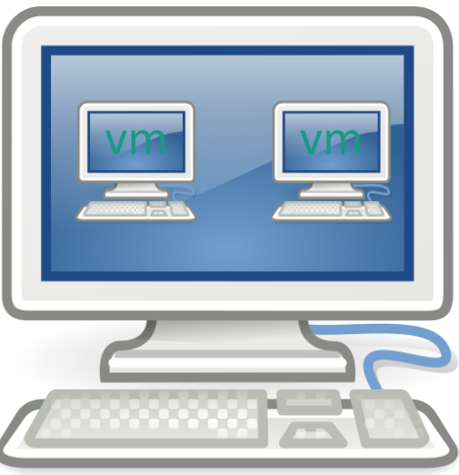
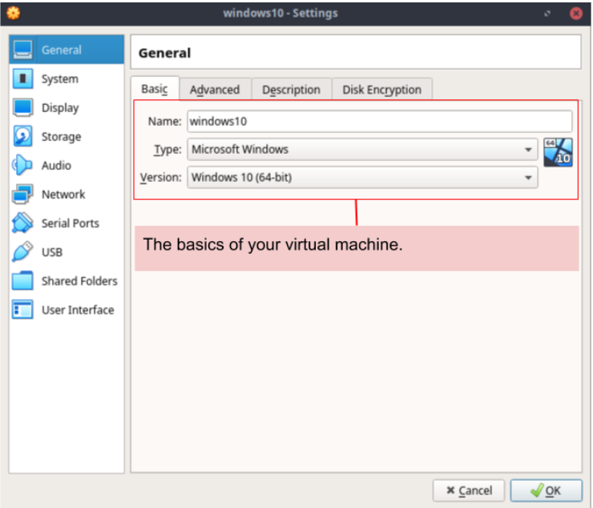
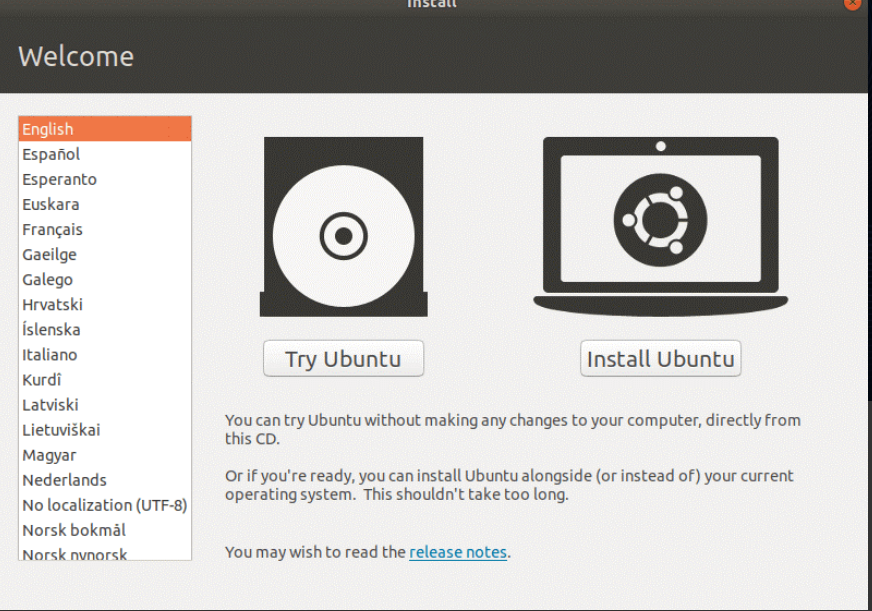
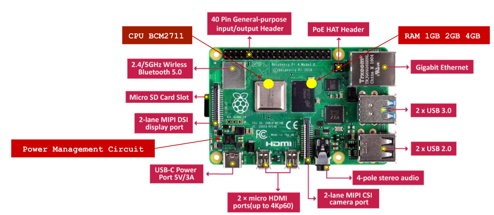
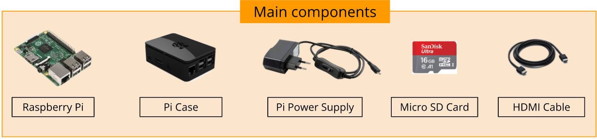

Note 2.md
# What is Virtualization?
Virtualization is the act of creating a virtual (rather than actual) version of something, including virtual computer hardware platforms, storage devices, and computer network resources.

## Types of general virtualization
* **Server-side virtualization**
  Virtual Desktop Infrastructure (VDI)
     * Thick or fat clint
     * Thin clint
     * Zero  clint
* **Clint-side virtualization**
  For clintside virtualization a computer needs,
     * A hypervisor
     * Hardware support
        * Capable CPU
        * Enough RAM and Storage
# Using Virtualbox (optional)
## Install Virtualbox
* Open the VirtualBox website and download. 
* Open the VirtualBox and Navigate through the installation prompts. Do the following:
     * Click Next on the first three pages.
     * Click Yes when prompted.
     *  Click Install
     * Click Yes when prompted.
     * Click install
     * Click finish.
**Also download the virtual box extension pack.**

## Creating a Virtual Machine
* When creating a virtual machine, install the operating system just like a regular computer. This means that the installation disc(s) for the operating system install on the virtual machine.  
* click to the new icon bar to start
* Identify the operating system. For example, if installing Windows 10, choose "Microsoft Windows" from the Type menu, and then "Windows 10" from the Version menu.
* Click next and set the RAM.
* Create a virtual hard drive. Make sure that the virtual hard drive has at least enough space to install the operating system. The most common format for virtual hard drives is VDI (VirtualBox Disk Image).
* Start the operating system installation. Install the operating system. 
* Boot up your virtual machine.
* Shut down your virtual machine.
* Take snapshots of your virtual machine.

# Installing Ubuntu In a virtual machine
## Preparing Virtual Machine
* Open VirtualBox and click New.
* Enter a name and select Linux as the type.
* Select Ubuntu 64-bit as the version.
* Click Create a virtual hard disk now.
* Click Install Ubuntu.
* Click Erase disk and install Ubuntu.
## Set up Ubuntu
* Select where you are and your time zone.
* Enable the on-screen keyboard.
* Enter name, user name, create password.
* Wait for Ubuntu to finish installing that restart the VM and log in to the computer. 

# What is a Raspberry Pi (optional)
A low cost, credit-card sized computer plugs into a computer, monitor ot tv. Its capable of doing everything a desktop computer do. 

## Types of Raspberry Pi
* Raspberry Pi 4
* Raspberry Pi 3
* Pi Zero W
* Pi 3 A+
* Pi 400
## Main components hardware for Raspberry Pi
* Raspberry Pi
* Pi case
* Pi power supply
* Micro SD card
* HDMI cable

