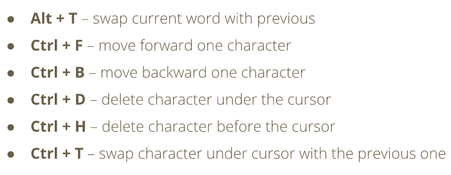
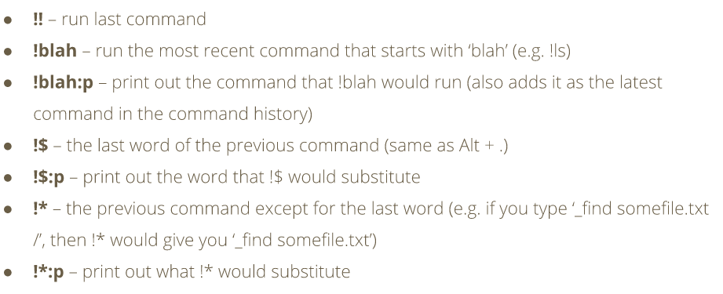
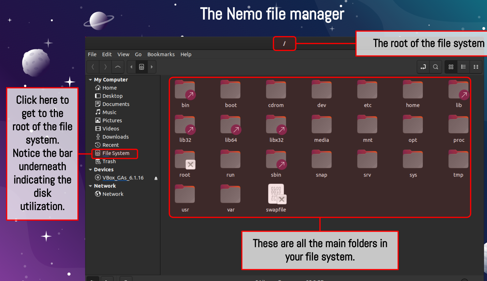
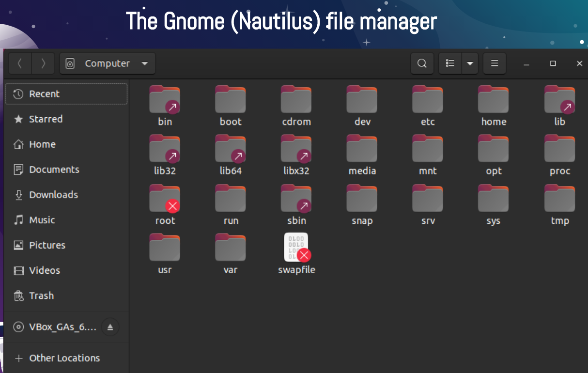
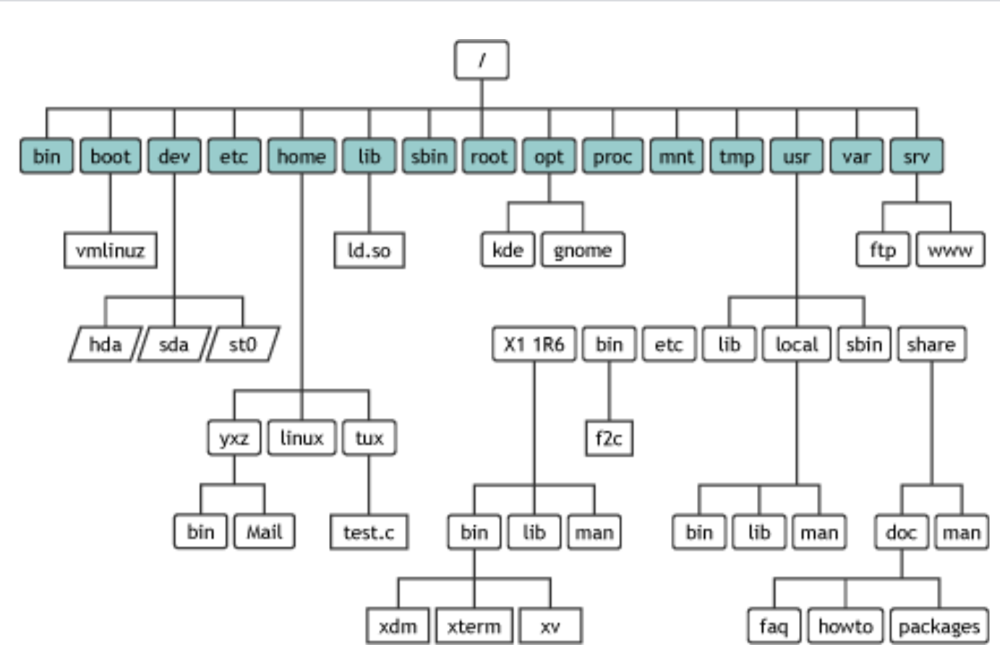
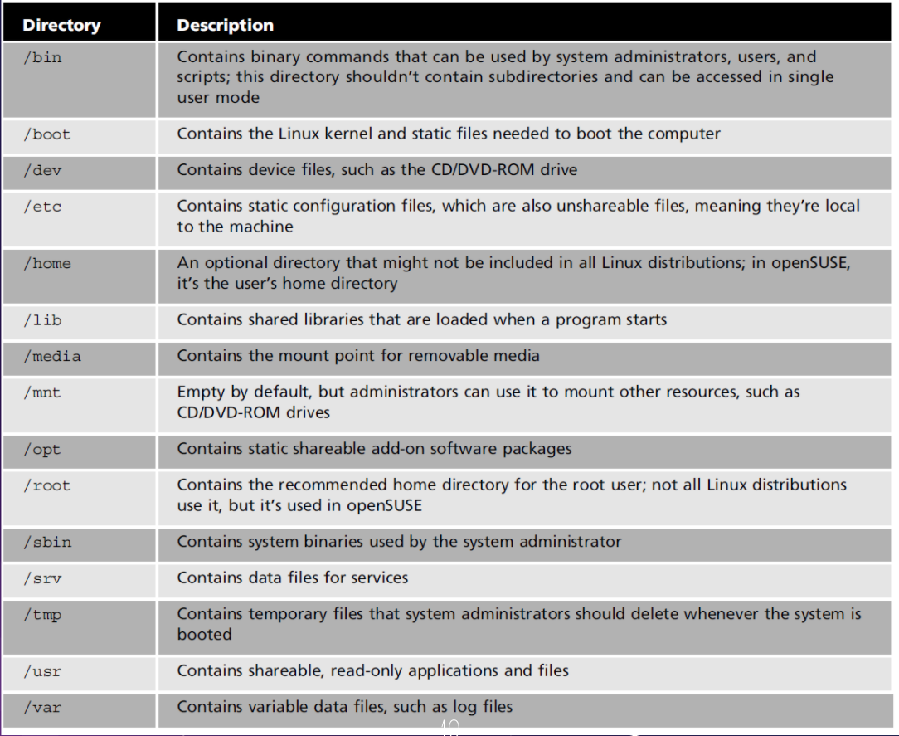
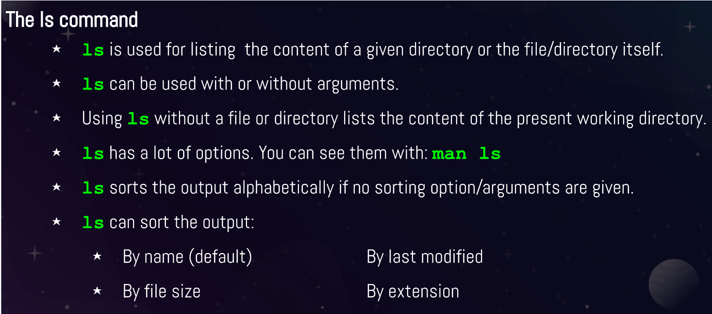
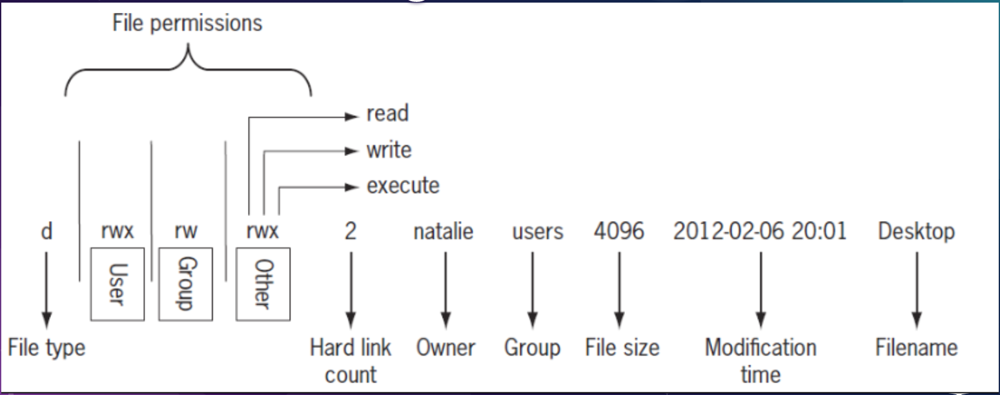
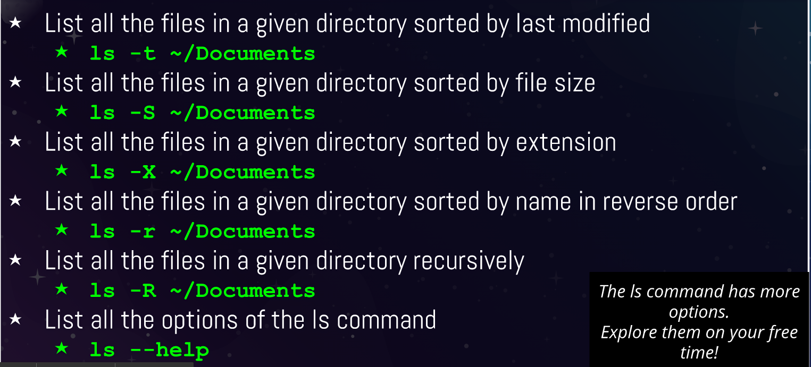
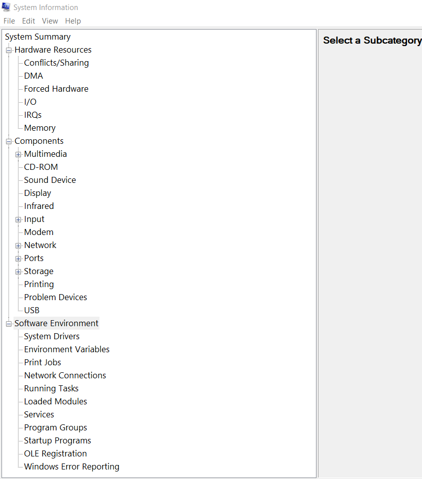

# What is a shell?
Shell is a program that takes commands from the keyboard and gives them to the operating system to perform.
## The Linux Terminal
* CLI: A command-line interface (CLI) processes commands to a computer program in the form of lines of text.
Two ways to access the CLI
   * Terminal Emulator
   * Linux Console
## The Bash Shell
Bash is a command processor that typically runs in a text window where the user types commands that cause actions. Bash is the shell, or command language interpreter, for the GNU operating system. 
Most Linux distribution use the bash shell as the default. Other shells are:
   * Tcsh Shell
   * Csh Shell
   * Ksh Shell
   * Zsh Shell
   * Fish Shell  
 

 

# Using the Terminal Emulator
Terminal emulator is a program that allows to access the Linux CLI. It is used most often if computer has GUI installed. Some terminal emulators are:
  * GNOME Terminal(included in Ubuntu 20.04)
  * Konsole
  * Terminology
  * RXVT-Unicode
  * TILIX
 

# The Linux Filesystem
## Navigating the filesystem
### Linux Directory Structure
**File System:** The way file are stored and organized to simplify access to data. Linux file organized is called hierarchical directory structure (tree like pattern of folders). Unlike Windows, Linux always have a single file system tree regardless of how many drives or storage devices are attached to the computer. 
  * The Nemo file Manager

  * The Gnome (Nautilus)file manager
  
  * The Thunar file manager

In a file system every file has a pathname which indicates the location of the file in the file system.

### Commands to move around the file system
* **The pwd command**: use for displaying the current working directory
* **The cd command:** Use for changing directory.
   * cd + destination
      * Destination can be ab absolute or relative path
      * Can traverse directories backward using (..) which will change one directory back -changes to the parent directory.
      * (.) Single dot means the current working directory 
      * If want to go to home directory use 
        * cd
        * cd ~
        * cd $HOME 
      * If go to the previous current working directory use    cd - 

    **Bash Feature:** 

* **The ls command:** Use for displaying all the files inside a given directory 
  
  Examples of ls command:
  
  Examining the ls-l command:
  
  
  

# Getting basic information about your system
* In Windows 10, on start button search for system information
* Doing so will open the System Information window. There are four tabs listed in the top-left corner of the window:
    * **System Summary** - This is the default tab to which System Information opens; it contains details about my computer's operating system, installed memory, and processor type.
    * **Hardware Resources** - View a list of all hardware drivers and information associated with devices (e.g., webcams or controllers) associated with my computer.
   * **Components** - View a list of technical components on my computer such as USB ports, the CD drive, and speakers.
  * **Software Environment**- View drivers and running processes on my computer.
  
    