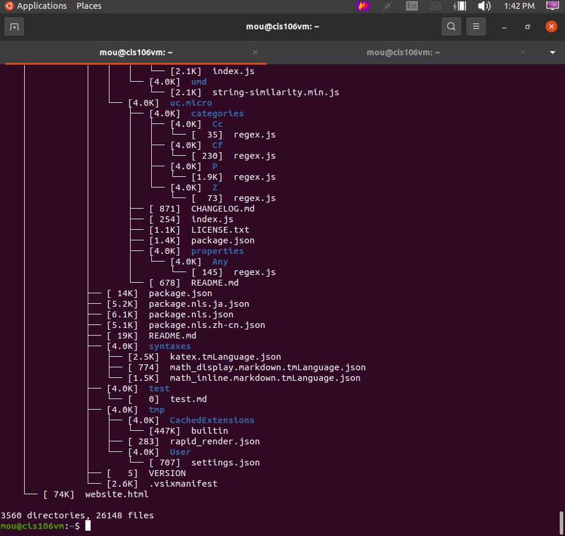

# Lab 3 | Installing software and navigating the file system | Answers
Assignment description [here](https://raw.githubusercontent.com/ra559/cis106/main/labs/lab3.md)

## Question 1
1. Which command did you use to search for the themes and to install them? 
 
     apt search theme
     sudo apt install 'darkfire-gtk-theme' 

2. Which commands did you use to find and install the web browser?

     apt search web browser
     sudo apt install 'dillo'

3.1 What is the name of the package?

     pink-pony/focal 1.4.1-2.1build4 amd64.deb

3.2 What dependencies are needed in order to install the package? (you can either take a screenshot of the terminal or copy and paste from the terminal)

3.3 How much disk space will the package utilize after installation?

     19.6 MB
 

## Question 2

## Question 3

## Question 4

## Question 5

