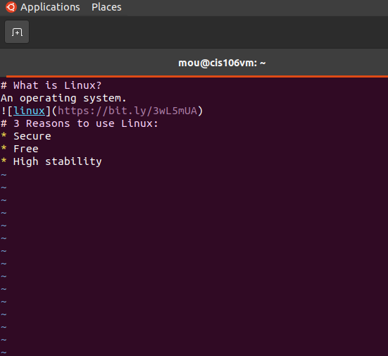
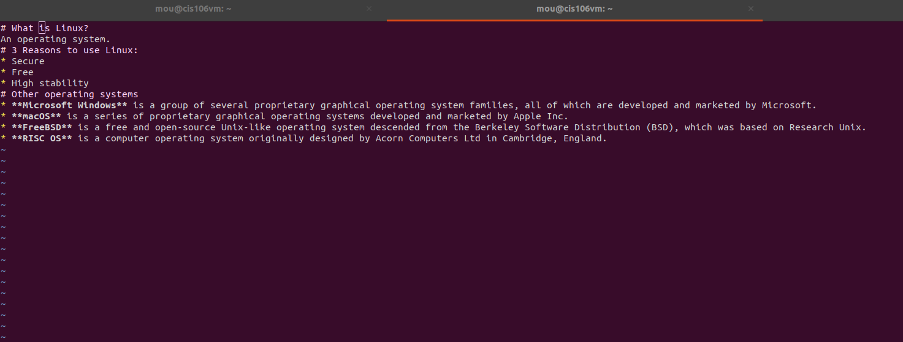
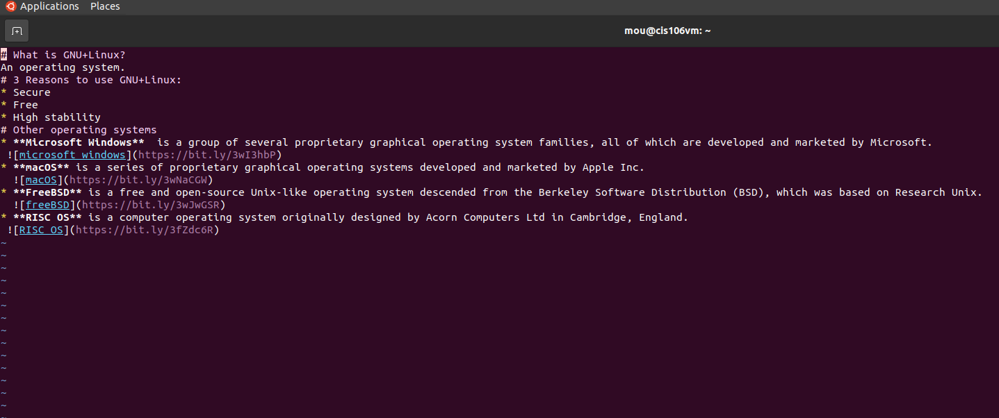

# Question 2

https://github.com/Mou2100/cis-106/blob/main/labs/GNU%2BLinux.md

https://github.com/Mou2100/cis-106/blob/main/labs/linux%2Bother.md

https://github.com/Mou2100/cis-106/blob/main/labs/linux.md