# Managing Files and Directories 
## Creating Directories
**The mkdir Command**
* Use tto create a single or multiple directories.
* Create directory type: **mkdir + directory name**
* To create multiple directories separate each dire. name with space.
* Create dire. in present or any working directory using absolute orr relative path.
  
  **Examples**
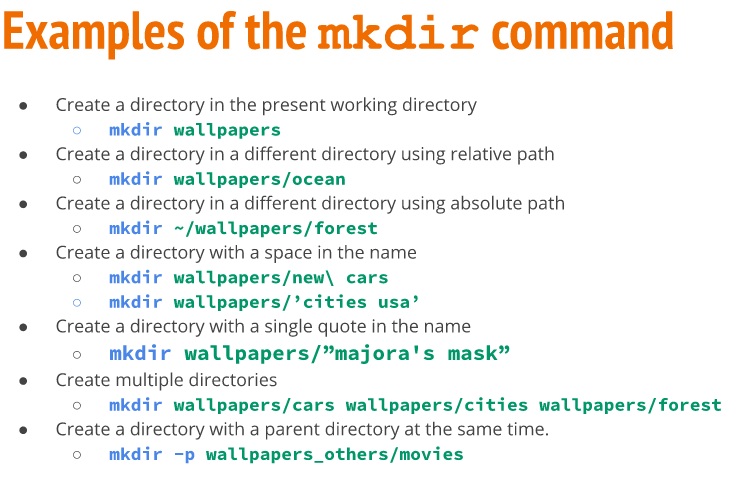  
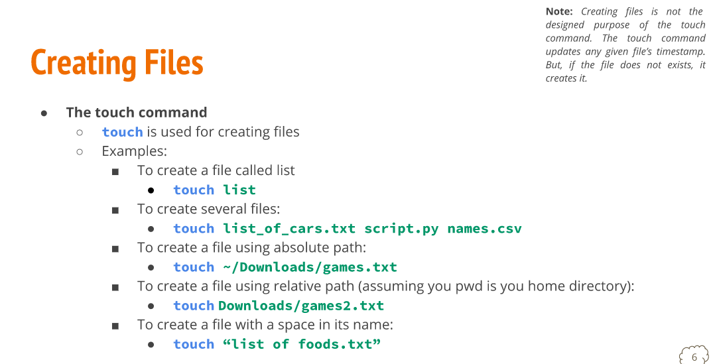
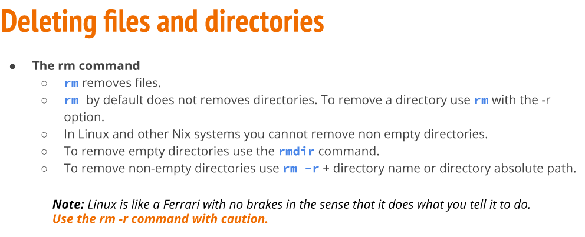
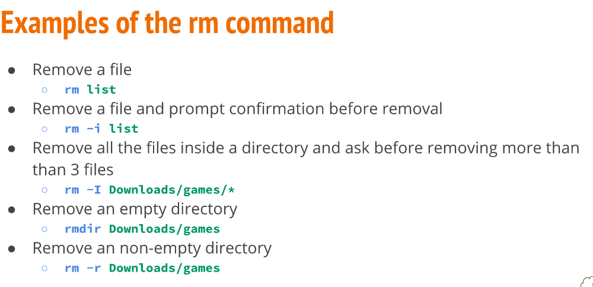

# Moving and Copying Files and Dire.
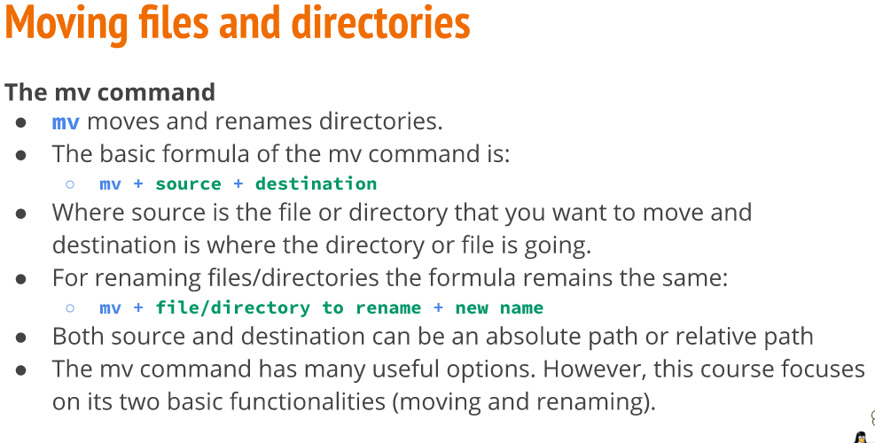
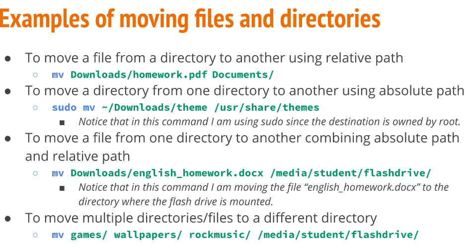

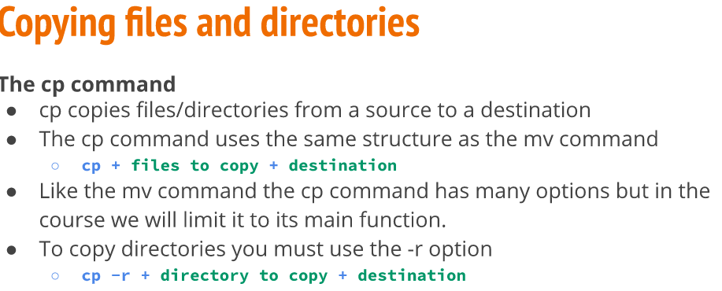
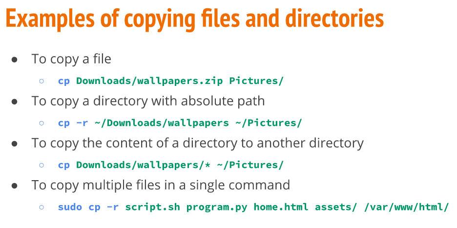

# Working with Linux
![examples](../imgs/notes4img10.PN
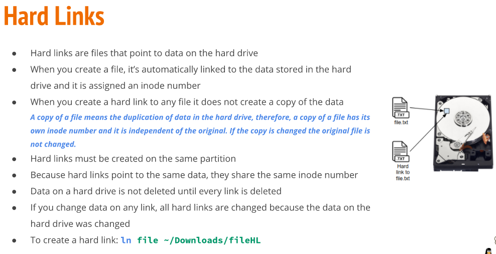
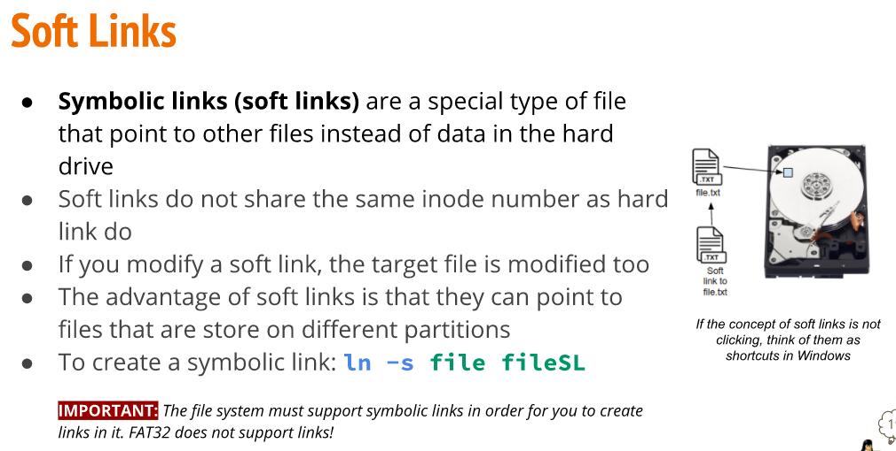
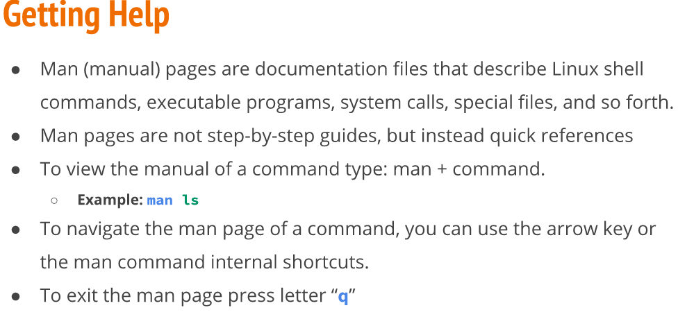
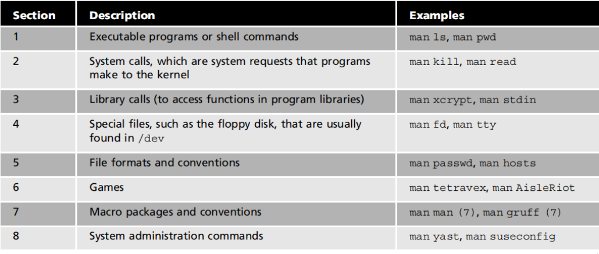

# Using Wildcards

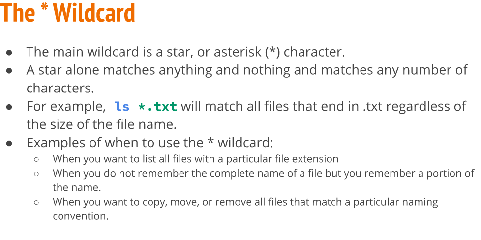
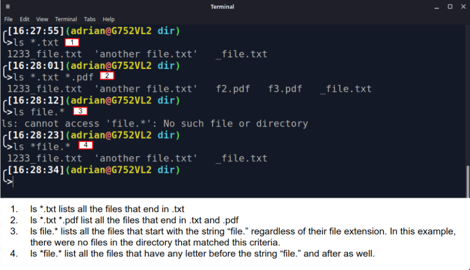
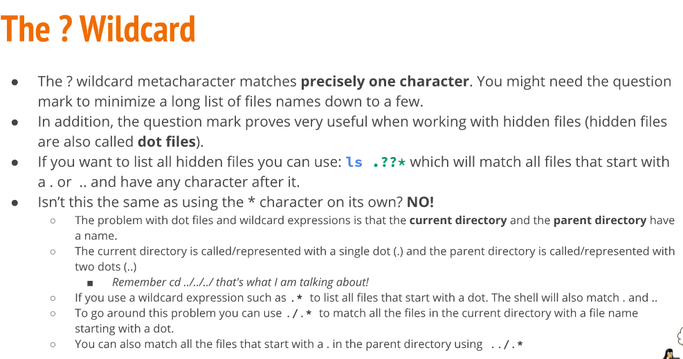
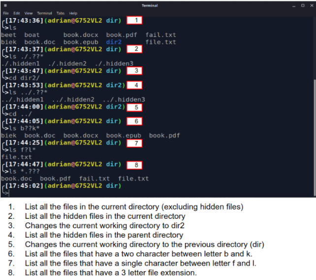
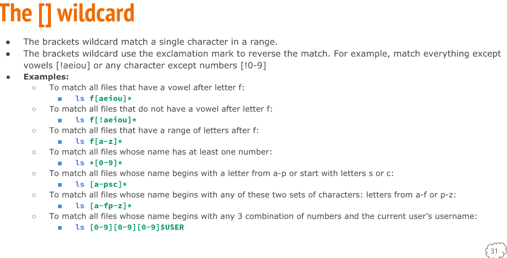
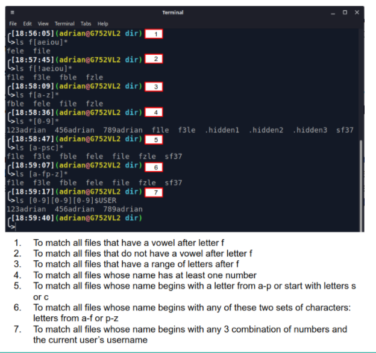
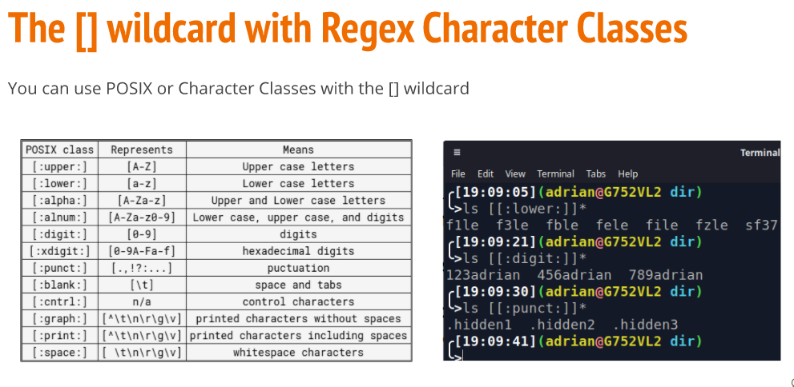
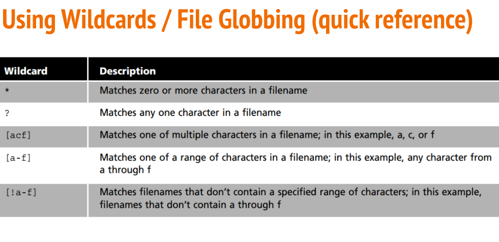
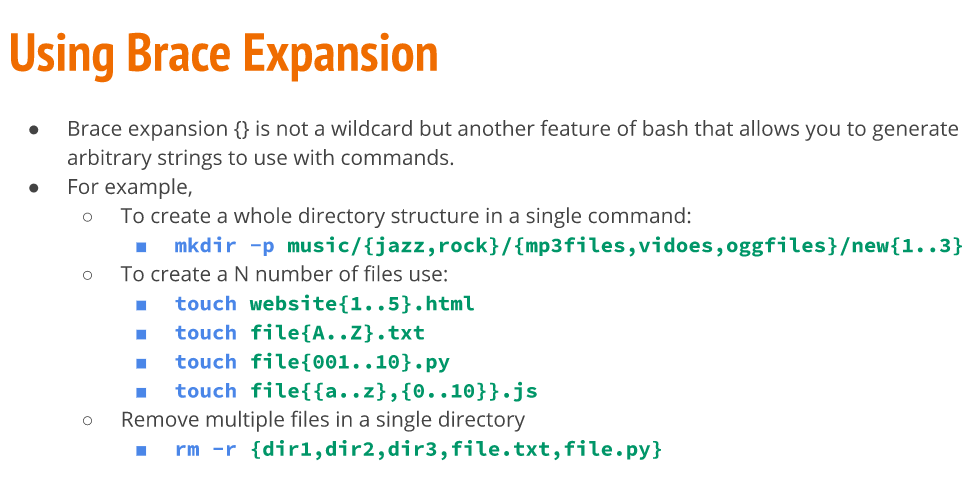
