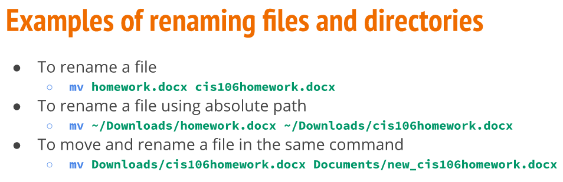

# Managing Files and Directories 
## Creating Directories
**The mkdir Command**
* Use tto create a single or multiple directories.
* Create directory type: **mkdir + directory name**
* To create multiple directories separate each dire. name with space.
* Create dire. in present or any working directory using absolute orr relative path.
  
  **Examples**
  

# Moving and Copying Files and Dire.

# Working with Linux

# Using Wildcards

